## Search GitHub for Issues, Comments, and Pull Requests

The flows function searches the GitHub over Graphql endpoint on hourly basis, records/updates the data in a database.  

To reduce the I/O load on the database, the data tables that are used by the project's front-end are created after the initial data were collected.

To avoid hitting the GitHub API rate limit, each query is limited to data points that are absolutely needed, meaningful participant's journey is stiched together over several queries at different stages of the project's execution. 

