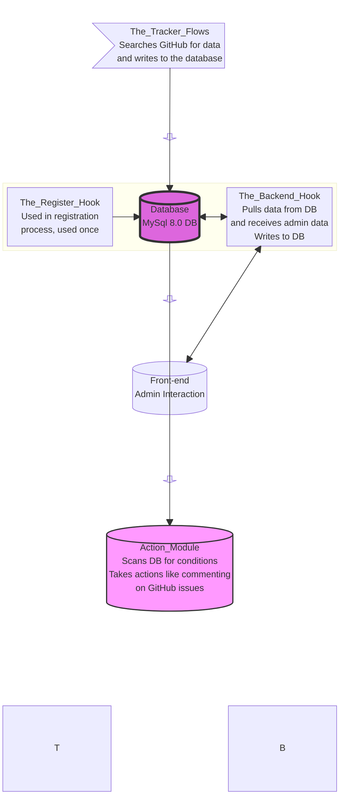

<!-- 

```mermaid
block-beta
    columns 3
    tracker>"The_Tracker_Flows\nSearches GitHub for data\nand writes to the database"]:3
    space down1<[" "]>(down) space

  block:e:3
          register["The_Register_Hook\nUsed in registration\nprocess, used once"]
          db[("Database\nMySql 8.0 DB")]
          backend["The_Backend_Hook\nPulls data from DB\nand receives admin data\nWrites to DB"]
  end
    space down2<[" "]>(down) space
    frontend[("Front-end\nAdmin Interaction")]:3
    space down3<[" "]>(down) space
    action_module[("Action_Module\nScans DB for conditions\nTakes actions like commenting\non GitHub issues")]:3
    space:3
    T space B
    tracker --> db
    register --> db
    db --> backend
    backend --> frontend
    frontend --> backend
    backend --> db
    db --> action_module
    style db fill:#d6d,stroke:#333,stroke-width:4px
    style action_module fill:#f9f,stroke:#333,stroke-width:2px

```
 -->
